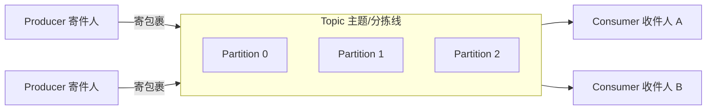
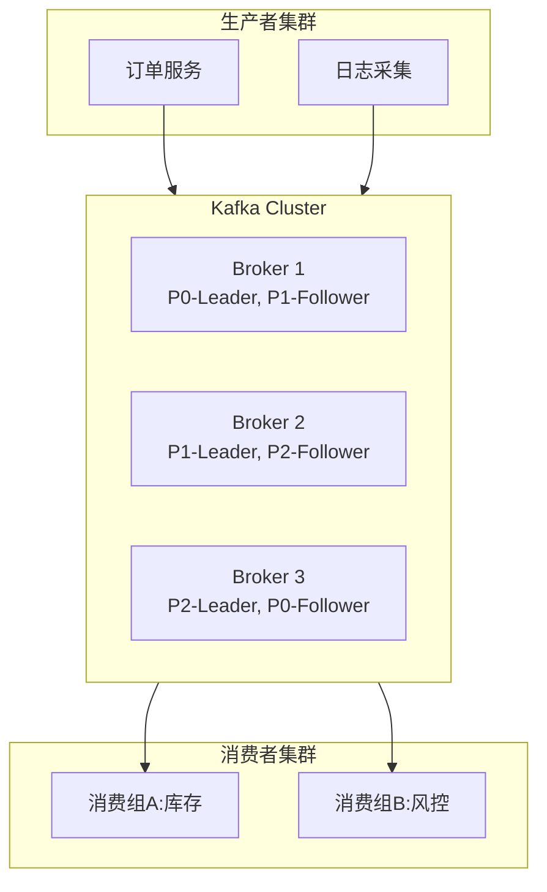
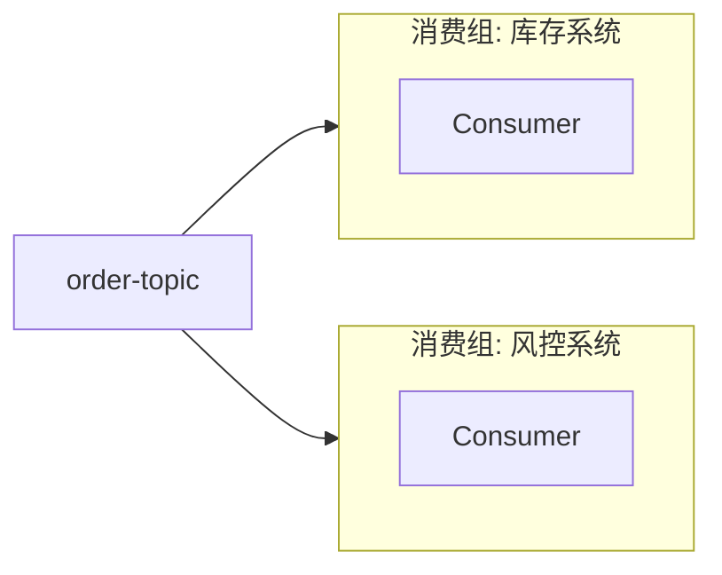
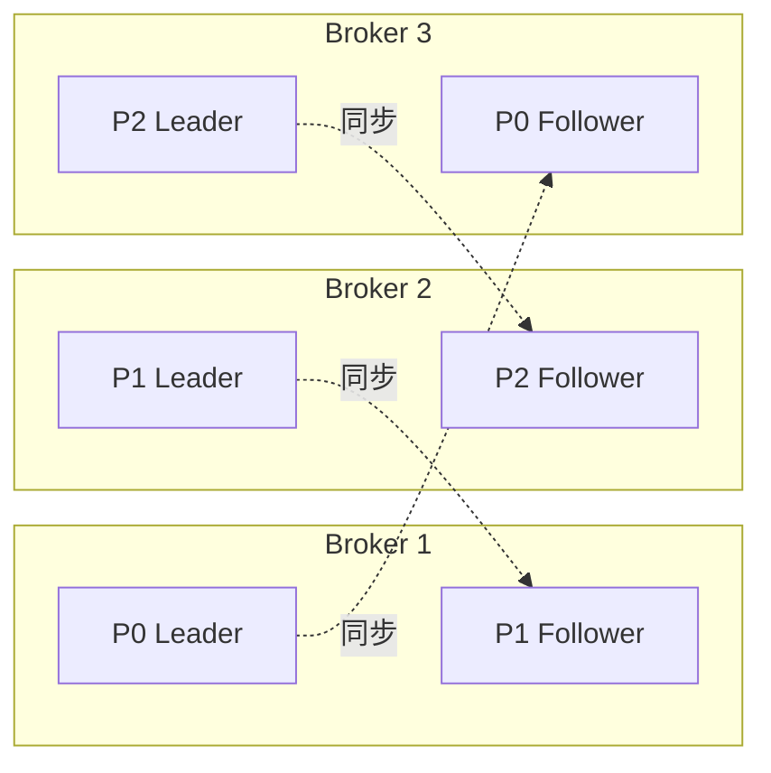
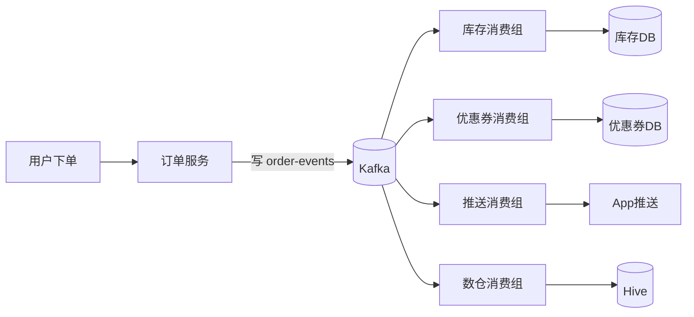
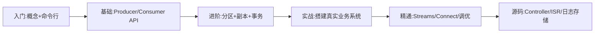

# Kafka 从入门到精通学习文档

> 用"快递分拣中心"理解分布式消息系统 —— 通俗比喻 + 图示 + 实战代码 + 面试避坑。

---

## 目录

- [第一章 初识 Kafka:它到底是什么?](#第一章-初识-kafka它到底是什么)
- [第二章 核心概念:用"快递分拣中心"读懂 Kafka](#第二章-核心概念用快递分拣中心读懂-kafka)
- [第三章 架构总览:Kafka 是怎么运转的](#第三章-架构总览kafka-是怎么运转的)
- [第四章 安装与第一个 Hello World](#第四章-安装与第一个-hello-world)
- [第五章 生产者(Producer)深入](#第五章-生产者producer深入)
- [第六章 消费者(Consumer)与消费者组](#第六章-消费者consumer与消费者组)
- [第七章 分区、副本与高可用](#第七章-分区副本与高可用)
- [第八章 消息可靠性:三大语义保证](#第八章-消息可靠性三大语义保证)
- [第九章 Kafka Streams 与实时计算](#第九章-kafka-streams-与实时计算)
- [第十章 性能调优与监控](#第十章-性能调优与监控)
- [第十一章 实战案例:用 Kafka 搭建一个订单系统](#第十一章-实战案例用-kafka-搭建一个订单系统)
- [第十二章 常见面试题与陷阱](#第十二章-常见面试题与陷阱)

---

## 第一章 初识 Kafka:它到底是什么?

### 一句话定义

**Kafka 是一个"分布式的、高吞吐量的消息中间件"。​**
把它想象成一个**超级巨大、永不打烊的快递分拣中心**:谁要寄包裹(数据),就交给它;谁要收包裹,自己来取就行。

### 生活化场景

你经营一家电商公司,用户下单后,需要同时通知:库存、支付、物流、积分、推荐 5 个系统。

- **没有 Kafka:​** 下单服务挨个去调用,任何一个挂了下单就卡住。
- **有了 Kafka:​** 下单服务只管把订单"扔进"Kafka,5 个系统各自来取,互不影响。

```
下单服务 ──放消息──► [ Kafka 分拣中心 ] ──► 库存系统
                                       ├──► 支付系统
                                       ├──► 物流系统
                                       ├──► 积分系统
                                       └──► 推荐系统
```

### Kafka 解决的三大痛点

| 痛点 | 没有 Kafka | 有了 Kafka |
|------|-----------|-----------|
| 系统耦合 | 改一个系统,牵连一大片 | 各系统只跟 Kafka 打交道 |
| 流量洪峰 | 双 11 直接打挂数据库 | Kafka 缓冲,下游慢慢消费 |
| 数据孤岛 | 日志/订单/行为各存各的 | 全部流入 Kafka,统一处理 |

---

## 第二章 核心概念:用"快递分拣中心"读懂 Kafka

### 一张图看懂所有术语



### 术语速查表(全部用大白话)

| 术语 | 通俗理解 | 现实类比 |
|------|---------|---------|
| **Broker** | 一台 Kafka 服务器 | 分拣中心里的一栋楼 |
| **Cluster** | 多台 Broker 组成的集群 | 整个分拣园区 |
| **Topic(主题)​** | 消息的分类 | 一条传送带,如"订单线""日志线" |
| **Partition(分区)​** | Topic 的物理切片 | 同一传送带的多条并行轨道,提升吞吐 |
| **Offset(偏移量)​** | 消息在分区里的编号 | 包裹上的流水号,从 0 递增 |
| **Producer(生产者)​** | 发消息的人 | 寄件人 |
| **Consumer(消费者)​** | 收消息的人 | 收件人 |
| **Consumer Group(消费组)​** | 一组消费者协作干活 | 一个快递站的多名快递员,分片送货 |
| **Replica(副本)​** | 分区的备份 | 包裹的复印件,放不同楼防火灾 |
| **Leader / Follower** | 主副本 / 从副本 | 主管收发,副手只同步 |
| **ZooKeeper / KRaft** | 集群管理者 | 园区调度中心 |

### 重点辨析:Topic / Partition / Offset

`order-topic` 有 3 个分区:

```
order-topic
├── Partition 0:  [msg0][msg1][msg2][msg3] ...   ← offset 递增
├── Partition 1:  [msg0][msg1][msg2] ...
└── Partition 2:  [msg0][msg1][msg2][msg3][msg4] ...
```

- 每条消息只属于一个分区(由 key 哈希或轮询决定)。
- **offset 仅在同一分区内有意义**——"读到分区 0 的 offset=100"是对的;"读到 topic 的 offset=100"是错的。
- **同一分区内消息严格有序;跨分区不保证顺序。​**

> ⚠️ 这是新手最容易踩的坑:**Kafka 只保证分区内有序,不保证主题级有序。​**

---

## 第三章 架构总览:Kafka 是怎么运转的



### 工作流程(以一条订单为例)

1. Producer 把 `{orderId:1001}` 发到 `order-topic`。
2. Kafka 按 `orderId` 哈希,决定它进 Partition 1。
3. Partition 1 的 Leader 在 Broker 2,消息写入磁盘。
4. Follower(Broker 3)同步这条消息,完成"双保险"。
5. 消费组 A(库存)和消费组 B(风控)分别独立读取这条消息。
6. 每个消费组维护自己的 offset,互不干扰。

---

## 第四章 安装与第一个 Hello World

### 推荐用 Docker 启动(最快)

```yaml
# docker-compose.yml
version: '3'
services:
  kafka:
    image: bitnami/kafka:3.7
    ports:
      - "9092:9092"
    environment:
      KAFKA_CFG_NODE_ID: 1
      KAFKA_CFG_PROCESS_ROLES: controller,broker
      KAFKA_CFG_LISTENERS: PLAINTEXT://:9092,CONTROLLER://:9093
      KAFKA_CFG_ADVERTISED_LISTENERS: PLAINTEXT://localhost:9092
      KAFKA_CFG_CONTROLLER_QUORUM_VOTERS: 1@localhost:9093
      KAFKA_CFG_CONTROLLER_LISTENER_NAMES: CONTROLLER
```

启动:`docker compose up -d`

### 命令行三板斧

```bash
# 1. 创建主题(3 分区,1 副本)
kafka-topics.sh --create --topic hello --partitions 3 --replication-factor 1 \
  --bootstrap-server localhost:9092

# 2. 生产消息
kafka-console-producer.sh --topic hello --bootstrap-server localhost:9092
> Hello Kafka
> 我的第一条消息

# 3. 消费消息(--from-beginning 从头读)
kafka-console-consumer.sh --topic hello --from-beginning \
  --bootstrap-server localhost:9092
```

---

## 第五章 生产者(Producer)深入

### Java 示例:发送一条订单

```java
Properties props = new Properties();
props.put("bootstrap.servers", "localhost:9092");
props.put("key.serializer", "org.apache.kafka.common.serialization.StringSerializer");
props.put("value.serializer", "org.apache.kafka.common.serialization.StringSerializer");
props.put("acks", "all");                  // 最强可靠性
props.put("retries", 3);                   // 失败重试
props.put("enable.idempotence", true);     // 幂等,防重复

KafkaProducer<String, String> producer = new KafkaProducer<>(props);

ProducerRecord<String, String> record =
    new ProducerRecord<>("order-topic", "order-1001", "{\"amount\":99.9}");

producer.send(record, (metadata, e) -> {
    if (e == null) {
        System.out.printf("发送成功 → 分区:%d  offset:%d%n",
            metadata.partition(), metadata.offset());
    } else {
        e.printStackTrace();
    }
});
producer.close();
```

### 关键参数解读(通俗版)

| 参数 | 通俗含义 | 推荐值 |
|------|---------|--------|
| `acks` | 寄件要不要签收? `0`=扔了就走 `1`=主管签收 `all`=主管+副手都签 | 重要业务用 `all` |
| `retries` | 失败重试几次 | 3~5 |
| `batch.size` | 攒够多大一批再发 | 16KB~64KB |
| `linger.ms` | 最多等多久凑一批 | 5~20ms |
| `compression.type` | 压缩算法 | `lz4` 或 `zstd` |
| `enable.idempotence` | 幂等,防重复 | **必开** |

### 分区策略

- **指定 key**:相同 key 永远进同一分区 → 适合"同一订单的所有事件保持顺序"。
- **不指定 key**:轮询或粘性分区(Sticky) → 适合负载均衡。
- **自定义 Partitioner**:按业务规则路由(如 VIP 用户专属分区)。

---

## 第六章 消费者(Consumer)与消费者组

### 核心规则(必背)

> **同一个消费组里,一个分区只能被一个消费者消费。​**

#### 例:3 个分区,几个消费者最合理?

```
Topic: order-topic (3 partitions)

情况1: 1 个消费者  → 一人扛 3 个分区(慢)
情况2: 3 个消费者  → 一人一个分区(最佳并行)
情况3: 5 个消费者  → 多出 2 个闲着(浪费)
```

**结论:消费者数 ≤ 分区数,才能充分并行。​**

### 不同消费组互不影响



库存读到 offset=500,风控读到 offset=300,各管各的。这就是 Kafka **既支持"发布订阅"又支持"点对点"​** 的精妙之处。

### Java 消费者示例

```java
Properties props = new Properties();
props.put("bootstrap.servers", "localhost:9092");
props.put("group.id", "inventory-group");
props.put("enable.auto.commit", "false");   // 关闭自动提交,手动控制
props.put("key.deserializer", "org.apache.kafka.common.serialization.StringDeserializer");
props.put("value.deserializer", "org.apache.kafka.common.serialization.StringDeserializer");

KafkaConsumer<String, String> consumer = new KafkaConsumer<>(props);
consumer.subscribe(Arrays.asList("order-topic"));

while (true) {
    ConsumerRecords<String, String> records = consumer.poll(Duration.ofMillis(500));
    for (ConsumerRecord<String, String> r : records) {
        try {
            handleOrder(r.value());          // 业务处理
            consumer.commitSync();           // 成功后再提交 offset
        } catch (Exception e) {
            // 失败不提交,下次重新消费
        }
    }
}
```

### Offset 提交策略对比

| 策略 | 优点 | 缺点 | 适用场景 |
|------|------|------|---------|
| 自动提交 | 简单 | 可能丢/重 | 日志、监控 |
| 手动同步提交 | 可靠 | 慢 | 订单、支付 |
| 手动异步提交 | 快 | 失败需补偿 | 高吞吐场景 |

---

## 第七章 分区、副本与高可用

### 副本机制图解



- **Leader** 负责读写。
- **Follower** 只同步数据,不对外服务。
- Leader 挂了,Kafka 从 **ISR(同步副本集合)​** 中选一个 Follower 上位。

### ISR 是什么?(In-Sync Replicas)

> 一群"跟得上节奏"的副本。如果某个 Follower 太慢(默认 10 秒没同步),就被踢出 ISR。

**只有 ISR 里的副本才有资格被选为新 Leader**,以此保证切换后数据不丢。

---

## 第八章 消息可靠性:三大语义保证

| 语义 | 含义 | 现实类比 |
|------|------|---------|
| **At most once(至多一次)​** | 可能丢,但绝不重 | 普通短信 |
| **At least once(至少一次)​** | 不会丢,可能重 | 重要邮件反复发直到确认 |
| **Exactly once(恰好一次)​** | 不丢不重 | 银行转账 |

### 如何做到 Exactly Once?

1. **生产端**开启幂等 `enable.idempotence=true`(Kafka 用 PID + 序列号自动去重)。
2. **消费端**把"业务处理"和"offset 提交"放进**同一个事务**。

```java
producer.initTransactions();
try {
    producer.beginTransaction();
    producer.send(record1);
    producer.send(record2);
    producer.sendOffsetsToTransaction(offsets, "group-A");
    producer.commitTransaction();
} catch (Exception e) {
    producer.abortTransaction();
}
```

### 消息丢失的三个可能点 + 解决方案

| 环节 | 丢失原因 | 解决 |
|------|---------|------|
| Producer → Broker | `acks=0/1` 时 Leader 挂了 | `acks=all` + `retries>0` |
| Broker 内部 | 副本太少,机器全挂 | `replication.factor≥3`,`min.insync.replicas≥2` |
| Broker → Consumer | 自动提交后崩溃 | 关闭自动提交,**业务成功后再提交** |

---

## 第九章 Kafka Streams 与实时计算

Kafka 不只是消息队列,它还是**流处理平台**。

### 实时统计 UV 的例子

```java
StreamsBuilder builder = new StreamsBuilder();
KStream<String, String> clicks = builder.stream("user-clicks");

clicks.groupBy((k, v) -> extractUserId(v))
      .windowedBy(TimeWindows.of(Duration.ofMinutes(1)))
      .count()
      .toStream()
      .to("uv-per-minute");

new KafkaStreams(builder.build(), props).start();
```

短短几行,就完成了:**每分钟统计每个用户点击次数,结果写回新 Topic**。

### Kafka Streams vs Flink

| 维度 | Kafka Streams | Flink |
|------|---------------|-------|
| 部署 | 普通 Java 应用 | 独立集群 |
| 复杂度 | 低 | 高 |
| 场景 | 中小规模、紧贴 Kafka | 大规模、复杂窗口/状态 |

---

## 第十章 性能调优与监控

> **Kafka 快的核心三招:顺序写磁盘、零拷贝(sendfile)、批量压缩。​**

### 调优 Checklist

**Broker 端:​**
- `num.io.threads` ≈ CPU 核数
- `num.network.threads` ≈ CPU 核数 / 2
- `log.segment.bytes` = 1GB
- 使用 SSD,日志目录分散到多块盘

**Producer 端:​**
- `batch.size` 调大 + `linger.ms` 适度
- 开启 `lz4` / `zstd` 压缩
- `buffer.memory` ≥ 64MB

**Consumer 端:​**
- `fetch.min.bytes` 调大,减少网络往返
- `max.poll.records` 根据处理能力调整

### 监控指标(必看)

| 指标 | 含义 | 报警阈值 |
|------|------|---------|
| Under-Replicated Partitions | 副本同步落后的分区数 | > 0 |
| Consumer Lag | 消费者落后多少条消息 | 持续上涨即报警 |
| Request Latency | 请求延迟 | > 100ms |
| Disk Usage | 磁盘占用 | > 80% |

推荐工具:**Prometheus + Grafana + Kafka Exporter**、**Confluent Control Center**、**Kafdrop**(轻量 Web UI)。

---

## 第十一章 实战案例:用 Kafka 搭建一个订单系统

### 业务场景

电商下单后,需要同时:
1. 扣库存
2. 发优惠券
3. 推送 App 消息
4. 写数据仓库做分析

### 架构设计



### 关键设计决策

1. **Topic 命名:​** `order-events`,按业务领域划分,不按消费方划分。
2. **分区数:​** 预估峰值 QPS=5000,单分区吞吐 ~1000/s → **至少 8 个分区**(留 buffer)。
3. **Key 选择:​** 用 `orderId` 作为 key,保证同一订单的"创建→支付→完成"事件落到同一分区,**保证顺序**。
4. **副本数:​** `replication.factor=3`,`min.insync.replicas=2`,允许挂一台。
5. **消费幂等:​** 每个消费方在自己 DB 里建一张 `processed_event(event_id PRIMARY KEY)` 表,**用主键冲突防重复消费**。

### 下单代码片段

```java
public void createOrder(Order order) {
    // 1. 本地事务写订单主表
    orderDao.insert(order);

    // 2. 发 Kafka 消息(更稳的做法是用 Outbox 模式)
    OrderEvent event = new OrderEvent(order.getId(), "CREATED", order);
    producer.send(new ProducerRecord<>(
        "order-events",
        String.valueOf(order.getId()),   // key = orderId,保证顺序
        JSON.toJSONString(event)
    ));
}
```

> 💡 **Outbox 模式:​** 先把消息写到本地"待发件箱"表,再由后台任务保证投递到 Kafka,避免"DB 提交了但 Kafka 发送失败"的不一致。

---

## 第十二章 常见面试题与陷阱

**Q1:Kafka 为什么这么快?​**
顺序磁盘 IO + 零拷贝(sendfile) + Page Cache + 批量压缩 + 分区并行。

**Q2:如何保证消息不丢?​**
三端同时保障:Producer `acks=all`;Broker `replication.factor≥3` 且 `min.insync.replicas≥2`;Consumer 关闭自动提交,业务成功后再提交 offset。

**Q3:如何保证消息不重复?​**
Producer 开启幂等;Consumer 业务上做幂等(唯一键、Redis 去重、事务表)。

**Q4:Kafka 如何保证顺序?​**
单分区天然有序。需要全局有序就只能用 1 个分区(牺牲吞吐);"业务有序"就把同业务消息用同一 key 路由到同一分区。

**Q5:消费者 Rebalance 会带来什么问题?​**
触发期间消费者停止工作(STW)。优化:使用 `Cooperative Sticky` 分配策略 + 合理设置 `session.timeout.ms` / `heartbeat.interval.ms`。

**Q6:ZooKeeper 和 KRaft 的区别?​**
Kafka 2.8 引入 KRaft,3.5+ 生产可用,4.0 起彻底移除 ZooKeeper。KRaft 用 Raft 协议自管理元数据,部署更简单、扩展性更好。

**Q7:如何处理消息堆积?​**
临时:加分区 + 加消费者并行;长期:优化下游处理逻辑、引入死信队列(DLQ)隔离坏消息、必要时降级丢弃非关键消息。

---

## 学习路径建议



**推荐资源:​**
- 官方文档:<https://kafka.apache.org/documentation/>
- 书籍:《Kafka 权威指南》《深入理解 Kafka》(朱忠华)
- 源码:<https://github.com/apache/kafka>

> 🎯 **学习心法:不要只看,一定要动手搭一个 3 节点集群,故意杀掉 Broker、模拟网络分区,你才能真正理解高可用是怎么实现的。​**
